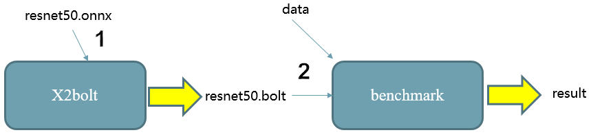

# Introduction

Bolt is a light-weight library for deep learning. Bolt, as a universal deployment tool for all kinds of neural networks, aims to minimize the inference runtime as much as possible. Higher speed, better security and more efficient memory management are the advantages that Bolt strives to provide. Bolt has been widely deployed and used in many departments of HUAWEI company, such as 2012 Laboratory, CBG and HUAWEI Product Lines. Feel free to make good use of issue submission, or **join our QQ chatroom (Chinese): 833345709**.

# Quick Start

Generally, there are two steps to get started with bolt. It's quiet easy for users to quickly running bolt.

1. Conversion: use **[X2bolt](model_tools/tools/X2bolt/X2bolt.cpp)** to convert your model from caffe,onnx,tflite or tensorflow to .bolt;

2. Inference: run **[benchmark](inference/examples/benchmark/benchmark.cpp)** with .bolt and data to get the inference result. 

   For more details about the usage of [**X2bolt**](model_tools/tools/X2bolt/X2bolt.cpp) and [**benchmark**](inference/examples/benchmark/benchmark.cpp) tools,  see [docs/USER_HANDBOOK.md](docs/USER_HANDBOOK.md). 

# Features

- ## Support Frameworks

  caffe, onnx, tflite, tensorflow
  
- ## Inference Precision

  Float32, Float16, Int8, 1-bit
  
- ## Hardware

  ARM CPU(v7, v8, v8.2),  Mali GPU, X86(AVX2)
  
- ## Verified Networks

  Bolt has shown its high performance in the inference of common CV and NLP neural networks. Some of the representative networks that we have verified are listed below. You can find detailed benchmark information in [docs/BENCHMARK.md](docs/BENCHMARK.md).

  | Application   | Models                                                       |
  | ------------- | ------------------------------------------------------------ |
  | CV            | Squeezenet/Mobilenet_v1/Mobilenet_v2/Mobilenet_v3/Resnet50 /[Ghostnet](https://github.com/huawei-noah/ghostnet)/SSD/Yolov3/Pointnet/...etc. |
  | NLP           | Bert/[TinyBert](https://github.com/huawei-noah/Pretrained-Language-Model/tree/master/TinyBERT)/Albert/Neural Machine Translation/Text To Speech /Automatic Speech Recognition/...etc. |
  | More DL Tasks | ...                                                          |

  More models than these mentioned above are supported,  users are encouraged to further explore.

- ## More Advanced Features

  - Graph Optimization
  - Thread Affinity
  - Algorithm Tuning
  - [Time-Series Data Acceleration](docs/USER_HANDBOOK.md#time-series-data-acceleration)

# Documentations

Everything you want to know about bolt is recorded in the detailed documentations stored in [docs](docs).

- [How to install bolt with different compilers](docs/INSTALL.md).
- [How to use bolt to inference your ML models.](docs/USER_HANDBOOK.md)
- [How to develop bolt to customize more models.](docs/DEVELOPER.md)
- [Benchmark results on some universal models.](docs/BENCHMARK.md)
- [How to build APP with kit.](docs/KIT.md)
- [Frequently Asked Questions(FAQ)](docs/FAQ.md)

# Acknowledgement

Bolt refers to the following projects: [caffe](https://github.com/BVLC/caffe), [onnx](https://github.com/onnx/onnx), [tensorflow](https://github.com/tensorflow/tensorflow), [ncnn](https://github.com/Tencent/ncnn), [mnn](https://github.com/alibaba/MNN), [dabnn](https://github.com/JDAI-CV/dabnn).

# License

The MIT License(MIT)
