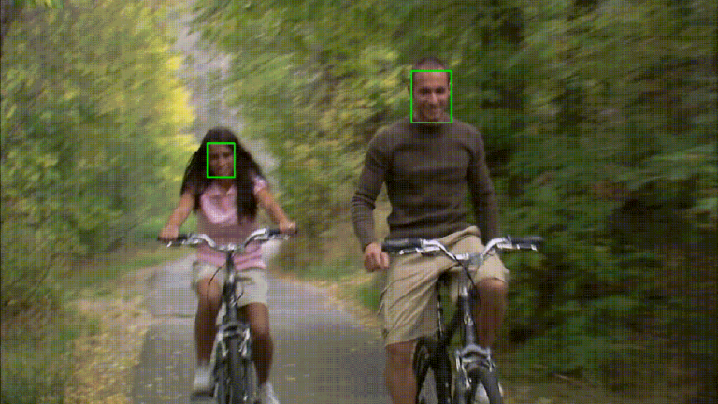
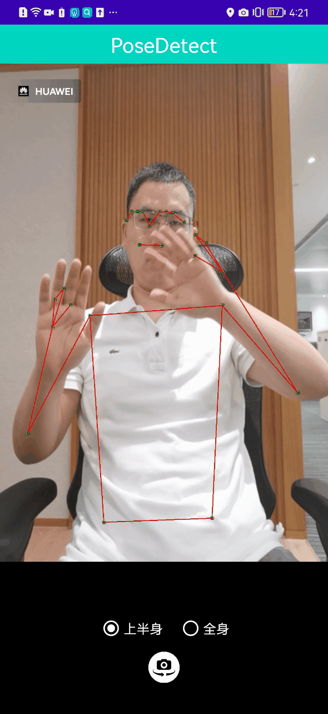
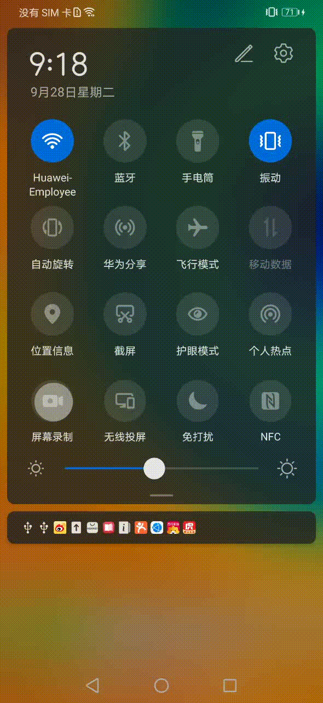
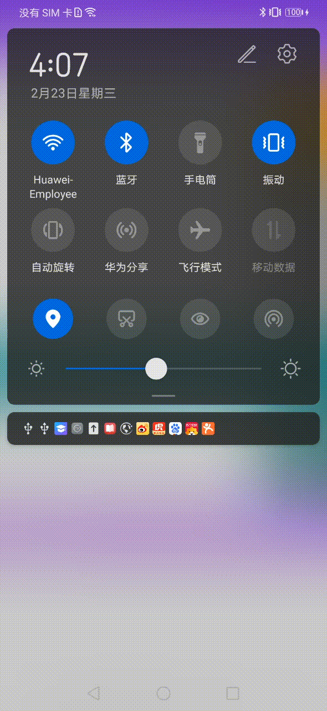
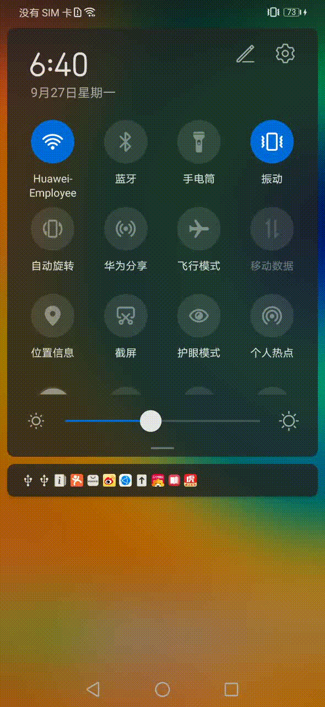

# Introduction
---

[Bolt](https://huawei-noah.github.io/bolt/) is a light-weight library for deep learning.
Bolt, as a universal deployment tool for all kinds of neural networks, aims to automate the deployment pipeline and achieve extreme acceleration.
Bolt has been widely deployed and used in many departments of HUAWEI company, such as 2012 Laboratory, CBG and HUAWEI Product Lines.
If you have questions or suggestions, you can submit issue. **QQ群: 833345709**

# Why Bolt is what you need?
---
- **High Performance:** **15%+** faster than existing open source acceleration libraries.
- **Rich Model Conversion:** support Caffe, ONNX, TFLite, Tensorflow.
- **Various Inference Precision:** support FP32, FP16, INT8, 1-BIT.
- **Multiple platforms:** ARM CPU(v7, v8, v8.2+, v9), X86 CPU(AVX2, AVX512), GPU(Mali, Qualcomm, Intel, AMD)
- **Bolt is the first to support NLP and also supports common CV applications.**
- **Minimize ROM/RAM**
- Rich Graph Optimization
- Efficient Thread Affinity Setting
- [Auto Algorithm Tuning](https://zhuanlan.zhihu.com/p/336218879)
- [Time-Series Data Acceleration](docs/USER_HANDBOOK.md#time-series-data-acceleration)

[See more excellent features and details here](https://zhuanlan.zhihu.com/p/317111024)

# Building Status
---
There are some common used platform for inference. More targets can be seen from [scripts/target.sh](scripts/target.sh). Please make a suitable choice depending on your environment. 
If you want to build on-device training module, you can add **--train** option.
If you want to use multi-threads parallel, you can add **--openmp** option.
If you want to build for cortex-M or cortex-A7 with restricted ROM/RAM(Sensor, MCU), you can see [docs/LITE.md](docs/LITE.md).

*Bolt defaultly link static library, This may cause some problem on some platforms. You can use --shared option to link shared library.*

| target platform        | precision          | build command                                        | Linux | Windows | MacOS |
| ---------------------- | ------------------ | ---------------------------------------------------- | ----- | ------- | ----- |
| Android(armv7)         | fp32,int8          | ./install.sh --target=android-armv7                  |  |  |  |
| Android(armv8)         | fp32,int8          | ./install.sh --target=android-aarch64 --fp16=off     |  |  |  |
| Android(armv8.2+)      | fp32,fp16,int8,bnn | ./install.sh --target=android-aarch64                |  |  |  |
| Android(armv9)         | fp32,fp16,bf16,int8,bnn | ./install.sh --target=android-aarch64_v9        |  |  |  |
| Android(gpu)           | fp16               | ./install.sh --target=android-aarch64 --gpu          |  |  |  |
| Android(x86_64)        | fp32,int8          | ./install.sh --target=android-x86_64                 |  |  |  |
| iOS(armv7)             | fp32,int8          | ./install.sh --target=ios-armv7                      | / | / |  |
| iOS(armv8)             | fp32,int8          | ./install.sh --target=ios-aarch64 --fp16=off         | / | / |  |
| iOS(armv8.2+)          | fp32,fp16,int8,bnn | ./install.sh --target=ios-aarch64                    | / | / |  |
| Linux(armv7)           | fp32,int8          | ./install.sh --target=linux-armv7_blank              |  | / | / |
| Linux(armv8)           | fp32,int8          | ./install.sh --target=linux-aarch64_blank --fp16=off |  | / | / |
| Linux(armv8.2+)        | fp32,fp16,int8,bnn | ./install.sh --target=linux-aarch64_blank            |  | / | / |
| Linux(x86_64)          | fp32,int8          | ./install.sh --target=linux-x86_64                   |  | / | / |
| Linux(x86_64_avx2)     | fp32               | ./install.sh --target=linux-x86_64_avx2              |  | / | / |
| Linux(x86_64_avx512)   | fp32,int8          | ./install.sh --target=linux-x86_64_avx512            |  | / | / |
| Windows(x86_64)        | fp32,int8          | ./install.sh --target=windows-x86_64                 | / |  | / |
| Windows(x86_64_avx2)   | fp32               | ./install.sh --target=windows-x86_64_avx2            | / |  | / |
| Windows(gpu)           | fp16               | ./install.sh --target=windows-x86_64_avx2 --gpu --fp16=on | / |  | / |
| Windows(x86_64_avx512) | fp32,int8          | ./install.sh --target=windows-x86_64_avx512          | / |  | / |
| Windows(armv8.2+)      | fp32,fp16,int8,bnn | ./install.sh --target=windows-aarch64                | / | / |  |
| MacOS(x86_64)          | fp32,int8          | ./install.sh --target=macos-x86_64                   | / | / |  |
| MacOS(x86_64_avx2)     | fp32               | ./install.sh --target=macos-x86_64_avx2              | / | / |  |
| MacOS(x86_64_avx512)   | fp32,int8          | ./install.sh --target=macos-x86_64_avx512            | / | / |  |
| MacOS(armv8.2+)        | fp32,fp16,int8,bnn | ./install.sh --target=macos-aarch64                  | / | / |  |

# Quick Start
---

Two steps to get started with bolt.

1. Conversion: use **[X2bolt](model_tools/tools/X2bolt/X2bolt.cpp)** to convert your model from caffe, onnx, tflite or tensorflow to .bolt file;

2. Inference: run **[benchmark](inference/examples/benchmark/benchmark.cpp)** with .bolt and data to get the inference result.

   For more details about the usage of [**X2bolt**](model_tools/tools/X2bolt/X2bolt.cpp) and [**benchmark**](inference/examples/benchmark/benchmark.cpp) tools,  see [docs/USER_HANDBOOK.md](docs/USER_HANDBOOK.md). 

# DL Applications in Bolt

  Here we show some interesting and useful applications in bolt.

| 
Image Classification [android](kit/Android/SimpleImageClassification) [ios](kit/iOS/SimpleImageClassification)
 | 
Face Detection [ios](kit/iOS/FaceDetection)  [exe](inference/examples/ultra_face)
 | 
Pose Detection [android](kit/Android/PoseDetect)
 |
| :------: | :------: | :------: |
|        |  |  |

| 
Semantics Analysis [android](kit/Android/Semantics)
 | 
Reading Comprehension [android](kit/Android/ReadingComprehension)
 | 
Chinese Speech Recognition [android](kit/Android/ChineseSpeechRecognition)    [ios](kit/iOS/ChineseSpeechRecognition)
 |
| :------: | :------: | :------: |
|  |  |  |

# Verified Networks
---
  Bolt has shown its high performance in the inference of common CV, NLP and Recommendation neural networks. Some of the representative networks that we have verified are listed below. You can find detailed benchmark information in [docs/BENCHMARK.md](docs/BENCHMARK.md).

  <table border="1"  bordercolor="#00CCCC"  width="300">
    <tr>
      <td>
        Application
      </td>
      <td>
        Models
      </td>
    </tr>
    <tr>
      <td>
        CV
      </td>
      <td>
        Resnet50, Shufflenet, Squeezenet, Densenet, Efficientnet, Mobilenet_v1, Mobilenet_v2, Mobilenet_v3,
        <a href="https://github.com/liuzechun/Bi-Real-net">BiRealNet</a>,
        <a href="https://github.com/liuzechun/ReActNet">ReActNet</a>,
        <a href="https://github.com/huawei-noah/ghostnet">Ghostnet</a>,
        <a href="https://github.com/milesial/Pytorch-UNet">unet</a>,
        LCNet, Pointnet,
        <a href="https://github.com/thangtran480/hair-segmentation">hair-segmentation</a>,
        <a href="https://github.com/onnx/models/tree/master/vision/object_detection_segmentation/duc">duc</a>,
        <a href="https://github.com/onnx/models/tree/master/vision/object_detection_segmentation/fcn">fcn</a>,
        <a href="https://github.com/onnx/models/tree/master/vision/object_detection_segmentation/retinanet">retinanet</a>,
        <a href="https://github.com/onnx/models/tree/master/vision/object_detection_segmentation/ssd">SSD</a>,
        <a href="https://github.com/onnx/models/tree/master/vision/object_detection_segmentation/faster-rcnn">Faster-RCNN</a>,
        <a href="https://github.com/onnx/models/tree/master/vision/object_detection_segmentation/faster-rcnn">Mask-RCNN</a>,
        <a href="https://github.com/onnx/models/tree/master/vision/object_detection_segmentation/yolov2-coco">Yolov2</a>,
        <a href="https://github.com/onnx/models/tree/master/vision/object_detection_segmentation/tiny-yolov3">Yolov3</a>,
        <a href="https://github.com/onnx/models/tree/master/vision/object_detection_segmentation/yolov4">Yolov4</a>,
        <a href="https://github.com/ultralytics/yolov5">Yolov5</a>,
        ViT, TNT, RepVGG, VitAE, CMT, EfficientFormer ...
      </td>
    </tr>
    <tr>
      <td>
        NLP
      </td>
      <td> Bert, Albert, Tinybert, Neural Machine Translation, Text To Speech(Tactron,Tactron2,FastSpeech+hifigan,melgan), Automatic Speech Recognition, DFSMN, Conformer,
        <a href="docs/USER_HANDBOOK.md#voice-wake-up">Tdnn</a>,
        <a href="https://tfhub.dev/google/lite-model/nonsemantic-speech-benchmark/frill-nofrontend/1">FRILL</a>,
        <a href="https://github.com/onnx/models/tree/master/text/machine_comprehension/t5">T5</a>,
        <a href="https://github.com/onnx/models/tree/master/text/machine_comprehension/gpt-2">GPT-2</a>,
        <a href="https://github.com/onnx/models/tree/master/text/machine_comprehension/roberta">Roberta</a>, Wenet ...
      </td>
    </tr>
    <tr>
      <td>
        Recommendation
      </td>
      <td>
        NFM, AFM, ONN, wide&deep, DeepFM, MMOE
      </td>
    </tr>
    <tr>
      <td>
        More DL Tasks
      </td>
      <td>
        ...
      </td>
    </tr>
  </table>

  More models than these mentioned above are supported, users are encouraged to further explore.

# On-Device Training
---
On-Device Training has come, it's a beta vesion which supports [Lenet](./training/demos/lenet_demo/), [Mobilenet_v1](./training/demos/mobilenet_v1_demo) and [Resnet18](./training/demos/resnet18_demo) for training on the embedded devices and servers. Want more details of on-device training in bolt? Get with the official training [tutorial](./training/TUTORIAL.md).

# Documentations
---
Everything you want to know about bolt is recorded in the detailed documentations stored in [docs](docs).

- [How to install bolt with different compilers?](docs/INSTALL.md).
- [How to use bolt to inference your ML models?](docs/USER_HANDBOOK.md)
	- [How to deploy Pytorch model?](docs/DEPLOYMENT_GUIDE_PYTORCH_CN.md)
	- [How to deploy Tensorflow model?](docs/DEPLOYMENT_GUIDE_TENSORFLOW_CN.md)
	- [How to deploy Onnx model?](docs/DEPLOYMENT_GUIDE_ONNX_CN.md)
	- [How to deploy Tflite model?](docs/DEPLOYMENT_GUIDE_TFLITE_CN.md)
	- [How to deploy Caffe model?](docs/DEPLOYMENT_GUIDE_CAFFE_CN.md)
- [How to develop bolt to customize more models?](docs/DEVELOPER.md)
- [Operators documentation](docs/OPERATORS.md)
- [Benchmark results on some universal models.](docs/BENCHMARK.md)
- [How to visualise/protect bolt model?](docs/USER_HANDBOOK.md#model-visualization)
- [How to build demo/example with kit?](docs/KIT.md)
- [Frequently Asked Questions(FAQ)](docs/FAQ.md)

# Articles
---
- [深度学习加速库Bolt领跑端侧AI](https://zhuanlan.zhihu.com/p/317111024)
- [为什么 Bolt 这么快：矩阵向量乘的实现](https://zhuanlan.zhihu.com/p/97928435)
- [深入硬件特性加速TinyBert，首次实现手机上Bert 6ms推理](https://zhuanlan.zhihu.com/p/158620259)
- [Bolt GPU性能优化，让上帝帮忙掷骰子](https://zhuanlan.zhihu.com/p/336218879)
- [Bolt助力HMS机器翻译，自然语言处理又下一城](https://zhuanlan.zhihu.com/p/337887620)
- [ARM CPU 1-bit推理，走向极致的道路](https://zhuanlan.zhihu.com/p/158161592)
- [基于深度学习加速库Bolt的声音克隆技术(Voice Cloning)](https://zhuanlan.zhihu.com/p/498919929)

# 教程
---
- 图像分类: [Android Demo](https://zhuanlan.zhihu.com/p/359264809), [iOS Demo](https://zhuanlan.zhihu.com/p/359259766)
- 图像增强: [Android Deme](./docs/DIT.md#camera-enlarge), [iOS Demo](./docs/DIT.md#camera-enlarge)
- 情感分类: [Android Demo](https://zhuanlan.zhihu.com/p/414971037)
- 中文语音识别: [Android Demo](https://zhuanlan.zhihu.com/p/414978782), [iOS Demo](https://zhuanlan.zhihu.com/p/414981121)
- 人脸检测: [Android Demo](https://zhuanlan.zhihu.com/p/414975102), [iOS Demo](https://zhuanlan.zhihu.com/p/414971375)

# Acknowledgement
---
Bolt refers to the following projects: [caffe](https://github.com/BVLC/caffe), [onnx](https://github.com/onnx/onnx), [tensorflow](https://github.com/tensorflow/tensorflow), [ncnn](https://github.com/Tencent/ncnn), [mnn](https://github.com/alibaba/MNN), [dabnn](https://github.com/JDAI-CV/dabnn).

# License
---
The MIT License(MIT)

