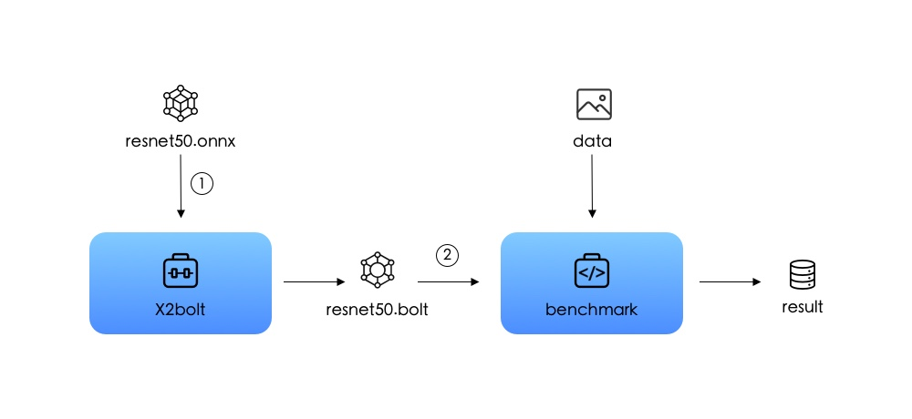

# Introduction

[Bolt](https://huawei-noah.github.io/bolt/) is a light-weight library for deep learning. Bolt, as a universal deployment tool for all kinds of neural networks, aims to minimize the inference runtime as much as possible.
Bolt has been widely deployed and used in many departments of HUAWEI company, such as 2012 Laboratory, CBG and HUAWEI Product Lines.
If you have questions or suggestions, you can submit issue. **QQ群: 833345709**

# Why Bolt is what you need?

- **High Performance:** **15%+** faster than existing open source acceleration libraries.
- **Rich Model Conversion:** support Caffe, ONNX, TFLite, Tensorflow.
- **Various Inference Precision:** support FP32, FP16, INT8, 1-BIT.
- **Multiple platforms:** ARM CPU(v7, v8, v8.2), Mali GPU, X86(AVX2)
- **Bolt is the first to support NLP and also supports common CV applications.**
- **Minimize ROM/RAM**
- Rich Graph Optimization
- Efficient Thread Affinity Setting
- [Auto Algorithm Tuning](https://zhuanlan.zhihu.com/p/336218879)
- [Time-Series Data Acceleration](docs/USER_HANDBOOK.md#time-series-data-acceleration)

[See more excellent features and details here](https://zhuanlan.zhihu.com/p/317111024)

# Building Status

Kinds of choices are provided for the compilation of bolt. Please make a suitable choice depending on your environment.

| target platform      | build command                                | Linux | Windows | MacOS |
| -------------------- | -------------------------------------------- | ----- | ------- | ----- |
| Android(armv7)       | ./install.sh --target=android-armv7          |  |  |  |
| Android(armv8+mali)  | ./install.sh --target=android-aarch64 --mali |  |  |  |
| Android(x86_64)      | ./install.sh --target=android-x86_64         |  |  |  |
| iOS(armv7)           | ./install.sh --target=ios-armv7              | / | / |  |
| iOS(armv8)           | ./install.sh --target=ios-aarch64            | / | / |  |
| Linux(X86_64)        | ./install.sh --target=linux-x86_64           |  | / | / |
| Linux(x86_64_avx2)   | ./install.sh --target=linux-x86_64_avx2      |  | / | / |
| Windows(X86_64)      | ./install.sh --target=windows-x86_64         | / |  | / |
| Windows(x86_64_avx2) | ./install.sh --target=windows-x86_64_avx2    | / |  | / |
| MacOS(X86_64)        | ./install.sh --target=macos-x86_64           | / | / |  |
| MacOS(x86_64_avx2)   | ./install.sh --target=macos-x86_64_avx2      | / | / |  |

*NOTE: Bolt defaultly link static library, This may cause some problem on some platforms. You can use --shared option to link shared library.*

# Quick Start

Two steps to get started with bolt.

1. Conversion: use **[X2bolt](/model_tools/tools/X2bolt/X2bolt.cpp)** to convert your model from caffe,onnx,tflite or tensorflow to .bolt;

2. Inference: run **[benchmark](/inference/examples/benchmark/benchmark.cpp)** with .bolt and data to get the inference result.

   For more details about the usage of [**X2bolt**](model_tools/tools/X2bolt/X2bolt.cpp) and [**benchmark**](inference/examples/benchmark/benchmark.cpp) tools,  see [docs/USER_HANDBOOK.md](docs/USER_HANDBOOK.md). 

# Verified Networks

  Bolt has shown its high performance in the inference of common CV and NLP neural networks. Some of the representative networks that we have verified are listed below. You can find detailed benchmark information in [docs/BENCHMARK.md](docs/BENCHMARK.md).

  <table border="1"  bordercolor="#00CCCC"  width="300">
    <tr>
      <td>
        Application
      </td>
      <td>
        Models
      </td>
    </tr>
    <tr>
      <td>
        CV
      </td>
      <td>
        Resnet50, Shufflenet, Squeezenet, Densenet, Efficientnet, Mobilenet_v1, Mobilenet_v2, Mobilenet_v3,
        <a href="https://github.com/liuzechun/Bi-Real-net">BiRealNet</a>,
        <a href="https://github.com/liuzechun/ReActNet">ReActNet</a>,
        <a href="https://github.com/huawei-noah/ghostnet">Ghostnet</a>,
        SSD, Yolov3, Pointnet ...
      </td>
    </tr>
    <tr>
      <td>
        NLP
      </td>
      <td> Bert,
        Albert, Neural Machine Translation, Text To Speech, Automatic Speech Recognition,
        <a href="docs/USER_HANDBOOK.md#voice-wake-up">Tdnn</a> ...
      </td>
    </tr>
    <tr>
      <td>
        More DL Tasks
      </td>
      <td>
        ...
      </td>
    </tr>
  </table>

  More models than these mentioned above are supported,  users are encouraged to further explore.

# Documentations

Everything you want to know about bolt is recorded in the detailed documentations stored in [docs](docs).

- [How to install bolt with different compilers](docs/INSTALL.md).
- [How to use bolt to inference your ML models.](docs/USER_HANDBOOK.md)
- [How to develop bolt to customize more models.](docs/DEVELOPER.md)
- [Operators documentation](docs/OPERATORS.md)
- [Benchmark results on some universal models.](docs/BENCHMARK.md)
- [How to build demo/example with kit.](docs/KIT.md)
- [Frequently Asked Questions(FAQ)](docs/FAQ.md)

# Articles

- [深度学习加速库Bolt领跑端侧AI](https://zhuanlan.zhihu.com/p/317111024)
- [为什么 Bolt 这么快：矩阵向量乘的实现](https://zhuanlan.zhihu.com/p/97928435)
- [深入硬件特性加速TinyBert，首次实现手机上Bert 6ms推理](https://zhuanlan.zhihu.com/p/158620259)
- [Bolt GPU性能优化，让上帝帮忙掷骰子](https://zhuanlan.zhihu.com/p/336218879)
- [Bolt助力HMS机器翻译，自然语言处理又下一城](https://zhuanlan.zhihu.com/p/337887620)
- [ARM CPU 1-bit推理，走向极致的道路](https://zhuanlan.zhihu.com/p/158161592)

# 教程

- 图像分类: [Android Demo](https://zhuanlan.zhihu.com/p/359264809), [iOS Demo](https://zhuanlan.zhihu.com/p/359259766)

# Acknowledgement

Bolt refers to the following projects: [caffe](https://github.com/BVLC/caffe), [onnx](https://github.com/onnx/onnx), [tensorflow](https://github.com/tensorflow/tensorflow), [ncnn](https://github.com/Tencent/ncnn), [mnn](https://github.com/alibaba/MNN), [dabnn](https://github.com/JDAI-CV/dabnn).

# License

The MIT License(MIT)
