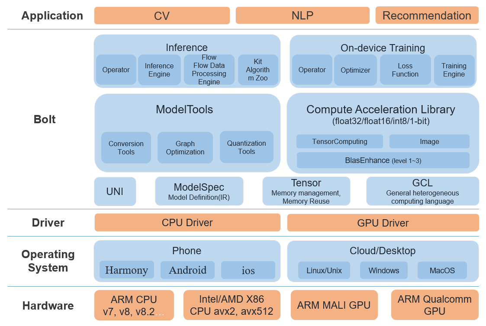

# Architecture

- [common](../common)
  - [uni](../common/uni) hosts the common headers that are used in bolt. 
  - [gcl](../common/gcl) hosts the setup of MALI GPU environment.
  - [memory](../common/memory) hosts the memory data management.
- [model_tools](../model_tools)
  - [X2bolt](../model_tools/tools/X2bolt) : a general converter of converting different deep learning models to bolt models.
  - [model_optimizer](../model_tools/include/model_optimizer.hpp) : a static computing graph optimizer to fuse the operators and simplify the calculation graph. 
- [compute](../compute)
  - [blas_enhance](../compute/blas_enhance) hosts the fast implementation of matrix-matrix multiplication and matrix-vector multiplication of FP32, FP16 and INT8. It is referenced by some of the operators in [tensor](compute/tensor).
  - [tensor](../compute/tensor) hosts the implementation for all kinds of operators defined by bolt.
  - [image](../compute/image) hosts common preprocessing routines for image inputs (e.g. bilinear interpolation).
- [inference](../inference)
  - [engine](../inference/engine) hosts the inference engine of neural networks.
  - [flow](../inference/flow) hosts the multi-backends(CPU+GPU) heterogeneous device schedule for time series data.
  - [examples](../inference/examples) gives some application examples (Network Benchmark, ImageNet classification).
- [kit](../kit)  
  - kit provides some application demos.

For API, Flow and operator development, please refer to [DEVELOPER.md](DEVELOPER.md).
