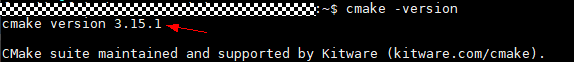
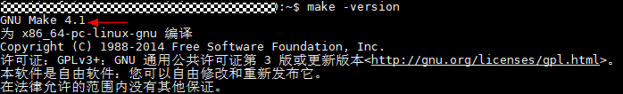
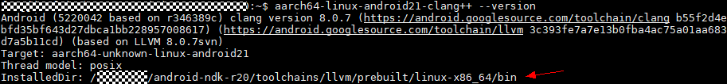
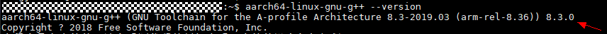
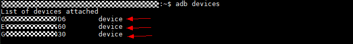
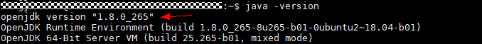
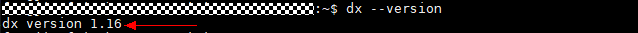

This document will help you compile and install bolt on your server. Generally, you only need to be concerned about two parts. The first part is how to build bolt which is described in the "Download and Build Bolt" section. The second part is when you fail to build bolt, you should check the "Prerequisites" section.

[Download and Build Bolt](#download-and-build-bolt)  
&nbsp;&nbsp;&nbsp;&nbsp;[Options](#options)   
&nbsp;&nbsp;&nbsp;&nbsp;[Environment variables](#environment-variables)  
[Prerequisites](#prerequisites)  
&nbsp;&nbsp;&nbsp;&nbsp;[Compilation Tools](#compilation-tools)  
&nbsp;&nbsp;&nbsp;&nbsp;[Android Tools](#android-tools)  
&nbsp;&nbsp;&nbsp;&nbsp;[Other Dependency Libraries](#other-dependency-libraries)  
&nbsp;&nbsp;&nbsp;&nbsp;[Optional Software](#optional-software)  
[Common install problem](#common-install-problem)  


# Download and Build Bolt

A simple shell script [install.sh](../install.sh) is provided to build and install the Bolt library, and you should modify it according to your scenario and environment. Set all the options correctly in [bolt.cmake](../common/cmakes/bolt.cmake). Use help message to find more useful information.

NOTE: Some Build options are set by default in [install.sh](../install.sh), which will overwrite the settings in [bolt.cmake](common/cmakes/bolt.cmake). You should check these two files meticulously before installation.

Here are the examples of installation on different platforms(*arm_gnu*, *arm_llvm*, *arm_ndkv7* and *x86_gnu*).

```shell
git clone https://github.com/huawei-noah/bolt.git
cd bolt

# build for ARM V8+ GNU CPU platform
./install.sh -c arm_gnu -t 33

# build for Android ARM V8+ CPU platform
./install.sh -c arm_llvm -t 33 -g OFF

# build for Android ARM V8+ CPU + MALI GPU platform
./install.sh -c arm_llvm -t 33 -g ON

# build for X86 GNU CPU platform
./install.sh -c x86_gnu -t 33

# build for Android ARM V7 CPU platform
./install.sh -c arm_ndkv7 -t 33
```

We will install Bolt to *install_<platform>* directory. These subdirectories will be found in it:

- include
    - [C API](../inference/engine/api/c) header file
    - [Java API](../inference/engine/api/java) class file
- lib
    - libBoltModel.so: build for Java application
    - libbolt.so: build for C/C++ application
    - libflow.so: flow sub project library
    - libinference.so: inference sub project library
    - libtensor.so: tensor computing sub project library
    - libimage.so: image sub project library
    - libblas_enhance.so: blas_enhance sub project library
    - libmodel_tools.so: model_tools sub project library
    - libuni.so: uni sub project library
- tools
  - *X2bolt* for generally converting deep learning(caffe/onnx/tflite) model to bolt model
  - *tensorflow2caffe* for converting tensorflow model to caffe model
  - *pytorch2caffe* for converting pytorch model to caffe model
  - *tensor_computing_library_search* for performance tuning of the operator library

- examples
    - *benchmark* for measuring inference performance of any model (.bolt)
    - *tinybert* for intention identification
    - *nmt* for machine translation
    - *classification* for imagenet classification task
    - *asr_rnnt* for automatic speech recognition task (RNNT model)
    - *asr_convolution_transformer* for automatic speech recognition task (Convolution+Transformer model)
    - *tts* for text to speech
- docs
    - API/html: doxygen html document for C/Java/Flow API   

If you want to build [operator uni tests](compute/tensor/tests) and [C](inference/examples/c_api/test_api.c)/[Java](inference/examples/java_api/test_api_java.java)/Flow API tests, please turn on the *BUILD_TEST* option when you build Bolt. These executables will be installed to ***install_<platform>/tests*** directory.

## Options

Here are all options in [bolt.cmake](../common/cmakes/bolt.cmake).

| options               | default | note                                          |
| --------------------- | ------- | --------------------------------------------- |
| USE_CROSS_COMPILE     | ON      | use cross compile or not                      |
| USE_GNU_GCC           | OFF     | use GNU gcc compler or not                    |
| USE_LLVM_CLANG        | OFF     | use LLVM clang compiler or not                |
| USE_IOS_CLANG         | OFF     | use ios compiler or not                       |
| USE_DYNAMIC_LIBRARY   | OFF     | use dynamic library or not                    |
| USE_MINSIZEREL        | OFF     | use cmake library storage size optimization   |
| USE_ANDROID_LOG       | OFF     | use Android log or not                        |
| USE_DEBUG             | OFF     | use debug information or not                  |
| USE_PROFILE           | OFF     | print each layer performance information or not |
| USE_PROFILE_STATISTICS | OFF     | print performance statistics information or not |
| USE_THREAD_SAFE       | OFF     | use thread safe function or not               |
| USE_CAFFE             | ON      | use caffe model as input or not               |
| USE_ONNX              | ON      | use onnx model as input or not                |
| USE_TFLITE            | ON      | use tflite model as input or not              |
| USE_TFLITE            | ON      | use tensorflow model as input or not          |
| USE_GENERAL           | ON      | use serial CPU code for debug or not          |
| USE_X86               | OFF     | use X86 AVX2 instruction or not               |
| USE_NEON              | OFF     | use ARM NEON instruction or not               |
| USE_ARMV7             | OFF     | use ARMv7 CPU or not                          |
| USE_ARMV8             | ON      | use ARMv8 CPU or not                          |
| USE_MALI              | ON      | use MALI GPU for parallel or not              |
| USE_FP32              | OFF     | use FP32 implementation or not                |
| USE_FP16              | ON      | use FP16 implementation or not                |
| USE_F16_MIX_PRECISION | ON      | use ARM NEON mixed-precision (F16/F32) or not |
| USE_INT8              | ON      | use INT8 implementation or not                |
| USE_OPENMP            | OFF     | use OpenMP to run operator multi-thread or not, currently only support partial float32 operator |
| USE_LIBRARY_TUNING    | ON      | use algorithm tuning or not                   |
| USE_FLOW              | ON      | use flow or not                               |
| USE_TEST              | OFF     | build unit test or not                        |


## Environment variables

Some Linux shell environment variables are reserved for Bolt.

- *BOLT_ROOT*: Bolt project home directory, set by user or Bolt.
- *BOLT_MEMORY_REUSE_OPTIMIZATION*: whether to use memory reuse optimization. The default value is ON and you can set it *OFF* to disable memory reuse optimization. Note that this setting takes effect during the model conversion. Once the model (.bolt) is stored, the memory reuse behavior is fixed.
- *Bolt_TensorComputing_LibraryAlgoritmMap*: a path on the target device set by user to save tensor_computing library performance tuning result.

# Prerequisites

## Compilation Tools

- ### Cmake

  <1> Installation

  ```
  sudo apt-get install cmake
  ```

  <2> Verfication

  ```
  cmake -version
  ```

  

  If cmake has been installed successfully, you can see the uniquely determined cmake version number (e.g. 3.15.1). If you fail to see the version number or the number you see is lower than 3.2.0, please reinstall the cmake tool on your server. You can refer to the [cmake official docs](https://cmake.org/install/) to implement the installation of cmake and set environment **PATH** to find it.

- ### GNU make

  <1> Installation

  ```
  sudo apt-get install make
  ```

  <2> Verification

  ```
  make -version
  ```

  

  If GNU make has been installed successfully, you can see the uniquely determined GNU make version number (e.g. 4.1). If you fail to see the version number or the number you see is lower than 3.81, please reinstall the GNU make tool on your server. You can refer to the [GNU make installation example](https://stackoverflow.com/questions/35568016/install-make-3-75-on-ubuntu-15-10) to implement the installation of GNU make and set the environment **PATH** to find it.

- ### Cross compiler

  NDK compiler uses Android NDK toolchains to build Bolt for Java APIs required by Android applications and ARM MALI GPU Bolt. ARM GNU compiler uses gcc to build Bolt for simple ARM CPU tests. Choose **one of them** according to your scenario.

  - Android NDK compiler

    <1> Installation

    Refer to the [NDK installation example](https://askubuntu.com/questions/837847/how-to-install-android-ndk) to install [android-ndk-r20](https://dl.google.com/android/repository/android-ndk-r20b-linux-x86_64.zip?hl=zh-cn) and set environment **PATH** to find *aarch64-linux-android21-clang++*.

    <2> Verification

    ```
    aarch64-linux-android21-clang++ --version
    ```

    

    If android ndk has been installed successfully, you can see the InstalledDir which represent the ndk compilers storage path. If you fail to see InstalledDir, please reinstall ndk and set the environment **PATH** to find it.

  - ARM GNU compiler

    <1> Installation

    ```
    sudo apt-get install gcc-arm-linux-gnueabi
    ```

    <2> Verification

    Install [gcc-arm-8.3-2019.03-x86_64-aarch64-linux-gnu](https://developer.arm.com/-/media/Files/downloads/gnu-a/8.3-2019.03/binrel/gcc-arm-8.3-2019.03-x86_64-aarch64-linux-gnu.tar.xz?revision=2e88a73f-d233-4f96-b1f4-d8b36e9bb0b9&la=en&hash=167687FADA00B73D20EED2A67D0939A197504ACD) and set Linux shell environment **PATH** to find *aarch64-linux-gnu-g++*. Simple test:

    ```
    aarch64-linux-gnu-g++ --version
    ```

    

    If GNU has been installed successfully, you can see the uniquely determined GNU compiler version number (e.g. 8.3.0). If you fail to see the version number or the number you see is lower than 8.3.0, please reinstall the ARM GNU compiler on your server. You can refer to the [GNU compiler installation example](https://askubuntu.com/questions/472219/how-to-install-gcc-4-7-arm-linux-gnueabihf-on-ubuntu-12-04) to install GNU compiler and set the environment **PATH** to find it.

## Android Tools

- ### ADB

  <1> Installation

  Refer to the [ADB installation example](https://unix.stackexchange.com/questions/378041/how-to-install-adb-on-ubuntu-from-download) to install [ADB](https://developer.android.com/studio/command-line/adb.html) tool helping you transfer the executables to android mobile phones.

  ```
  unzip platform-tools-latest-linux.zip
  cd platform-tools
  mv adb /usr/bin/adb
  ```

  <2> Verification

  ```
  # list all available android devices
  adb devices
  ```

  

  If GDB has been installed successfully, you can see all the android devices on your server.

## Other Dependency Libraries

Use [install script]() to install the dependency libraries(*protoc, protobuf, flatbuffers, tensorflow-lite, jpeg, ARM GPU OpenCL*) to the [third_party]() directory and generate a shell script to set up compilation environment. To choose ARM or X86, LLVM or GCC. Here is an example of installation for ARM NDK LLVM build.

```
./third_party/install.sh -c arm_llvm -t 33
```

## Optional Software

- ### JDK

If you want to compile Java programs, you need to download and install [Java SE Development Kit](https://www.oracle.com/java/technologies/oracle-java-archive-downloads.html) and set Linux shell environment **PATH**. Run the command "java -version" to verify whether jdk has been installed. 



You can see the uniquely determined JDK version number (e.g. 1.8.0_265). If you fail to see the version number or the number you see is lower than 1.8.0_265, please reinstall the JDK on your server. You can refer to the [JDK installation example](https://stackoverflow.com/questions/14788345/how-to-install-the-jdk-on-ubuntu-linux?page=2&tab=Votes) to install JDK and set the environment **PATH** to find it.

- ### Android dx

If you want to directly run *jar* file on Android device, you can use [Android dx tool](https://developer.android.com/studio/releases/build-tools). Install Android *v28.0.3* build tools and set Linux shell environment **PATH**. Run the command "dx --version" to verify the dx tool version.



You can see the uniquely determined dx version number (e.g. 1.16). If you fail to see the version number or the number you see is lower than 1.16, please reinstall the dx tool on your server. 


## Common install problem

- ### wget error

  Use wget to download file. If you use proxy to access the network, you may be reminded to add *--no-check-certificate* flag when using wget.
  
- ### curl error
  
  Use curl to download file. If you use proxy to access the network, you may encounter this error.
  
  error info:

    ```
    curl: (35) error:1408F10B:SSL routines:ssl3_get_record:wrong version number
    ```

  solution: use *wget* instead, or add *-k* flag.

    ```
    wget https://github.com/google/googlemock/archive/release-1.7.0.zip
    ```
    
- ### Download is limited by network proxy or time consuming.

  You can download these files and save to a specified directory, Bolt will automatically use it.
  
  1. save <https://github.com/protocolbuffers/protobuf/releases/download/v3.1.0/protoc-3.1.0-linux-x86_64.zip> to *third_party/sources/protoc-3.1.0-linux-x86_64.zip*.
  2. save <https://github.com/protocolbuffers/protobuf/archive/v3.1.0.tar.gz> to *third_party/sources/v3.1.0.tar.gz*.
  3. save <https://github.com/google/flatbuffers/tree/master/include> to *third_party/sources/flatbuffers/include*.
  4. save <https://github.com/tensorflow/tensorflow/blob/master/tensorflow/lite/schema/schema_generated.h> *third_party/sources/tflite/include/tensorflow/lite/schema/schema_generated.h*.
  5. save <https://github.com/KhronosGroup/OpenCL-Headers/tree/master/CL> to *third_party/sources/opencl/include/CL** when using **arm_llvm** flag.
  6. use *ADB* to pull android phone's </vendor/lib64/libOpenCL.so> and </vendor/lib64/egl/libGLES_mali.so> to *third_party/sources/opencl/lib64* when using **arm_llvm** flag.
  7. save <http://www.ijg.org/files/jpegsrc.v9c.tar.gz> to *third_party/sources/jpegsrc.v9c.tar.gz*.
  8. save <https://github.com/open-source-parsers/jsoncpp/archive/master.zip> to *third_party/sources/jsoncpp-master.zip*.
  9. save <http://www.fftw.org/fftw-3.3.8.tar.gz> to *third_party/sources/fftw-3.3.8.tar.gz*.
  10. save <https://github.com/google/googlemock/archive/release-1.7.0.zip> to *third_party/sources/googlemock-release-1.7.0.zip*.
  11. save <https://github.com/google/googletest/archive/release-1.7.0.zip> to *third_party/sources/googletest-release-1.7.0.zip*.
