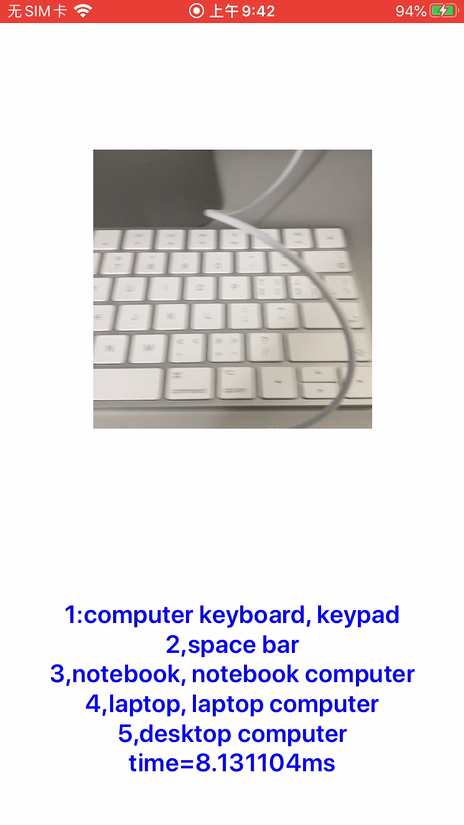

Kit is an experimental feature based on [Flow](DEVELOPER.md), which aims to simplify the integration of bolt into applications. At this stage we are still rapidly exploring different designs. In the long run we want to provide symmetrical APIs for different platforms including iOS, Android, etc.

In the [kit](../kit) directory, you can find the available demo project. In order to use the demo, bolt should be compiled first and some [headers and libraries](../kit/iOS/setup_lib_iOS.sh) need to be installed into the project, which is also taken care of in [install.sh](../install.sh). Currently we have uploaded an iOS project for image classification.

- # iOS Overview

  Our demo is using the Objective-C Language and the C++ API of Flow. Mainbody of the codes is in [ViewController.mm](../kit/iOS/image_classification/ImageClassificationDemo/ViewController.mm). There are some notes regarding iOS kits:

  - Compilation flags. The C++ API of Flow requires quite a few headers, and some compilation flags need to be set. For convenience, you can include [kit_flags.h](../kit/iOS/image_classification/ImageClassificationDemo/libbolt/headers/kit_flags.h) before including flow.h.
  - Model path in flow prototxt. Flow reads the model paths in prototxt in order to locate the models. On iOS, however, the exact storage path for model files is dynamically determined. [ViewController.mm](../kit/iOS/image_classification/ImageClassificationDemo/ViewController.mm) demonstrates how to update prototxt with the new model path.

- # Image Classification

  <div align=center></div>

  The demo takes video input from camera, and uses [GhostNet](https://github.com/huawei-noah/ghostnet) model trained on ImageNet. Given the same FLOPs, GhostNet shows a clear advantage over other lightweight CNNs. The models that we provide are trained with width as 1.0 on TensorFlow, which reaches a TOP1 accuracy of 74%.

  You can easily switch to other models trained on other datasets, following the steps below. As a tutorial, we will show how to change the model to the FP16 GhostNet that is also included in the project (kit/models). Tested with single thread on our iPhone SE, switching to FP16 GhostNet allows the processing of each 224x224 image frame in under 9 ms as shown in the figure above. You can try other models if your device is older than iPhone X and thus not in ARMv8.2 architecture.

  0. In [image_classification.prototxt](../kit/iOS/image_classification/ImageClassificationDemo/libbolt/image_classification.prototxt), you can see that the Inference node includes a path to ghostnet_f32.bolt. Actually, it is not necessary to change this path to ghostnet_f16.bolt, because this path will be dynamically overwritten as explained above. We will show how to switch to FP16 in Step 1.

    **In the following steps, if the file name is not specified, please check [ViewController.mm](../kit/iOS/image_classification/ImageClassificationDemo/ViewController.mm).**

  1. Switch to FP16 model. Change Line 78 to:

      ```
      NSString *boltPath=[[NSBundle mainBundle]pathForResource:@"ghostnet_f16" ofType:@"bolt"];
      ```
    
      Please also change the variable inferencePrecision to DT_F16.

  2. Adjust the pixelProcess function, which is registered as the preprocessing function for the Inference node. For FP16 inference, actual input to the model should be in FP16:

      ```
      F16 *oneArr = (F16 *)((CpuMemory *)outputs["input:0"]->get_memory())->get_ptr();
      ```

      If you are using your own model, change "input:0" to the name of your model input tensor.

      The provided Ghostnet requires input pixels organized as BGRBGRBGR... Adjust accordingly if your other model is trained with different preprocessing (i.e. normalizing each channel).

  3. Adjust the postProcess function, which is registered as the postprocessing function for the Inference node. For FP16 inference, the output score is also in FP16:

      ```
      F16 *score1000 =(F16 *)((CpuMemory *)inputs[boltModelOutputName]->get_memory())->get_ptr();
      ```

      If necessary, change boltModelOutputName to the name of your model output tensor. If your model is not trained on ImageNet, there may not be 1000 scores. You may also change the topK variable.

  4. If necessary, replace imagenet_classes.txt. Add codes to handle the class index numbers that Flow outputs.

  5. Please run it under file path "/data/local/tmp" for andriod devices to ensure the program get full authorities.
