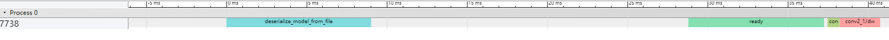

Before you try any step described in this document, please make sure you have installed Bolt correctly. You can refer to [INSTALL.md](INSTALL.md) for more details.

# Contents
&nbsp;&nbsp;&nbsp;&nbsp;[Basic Usage](#basic-usage)  
&nbsp;&nbsp;&nbsp;&nbsp;&nbsp;&nbsp;&nbsp;&nbsp;[Model Conversion](#model-conversion)   
&nbsp;&nbsp;&nbsp;&nbsp;&nbsp;&nbsp;&nbsp;&nbsp;[Model Inference](#model-inference)  
&nbsp;&nbsp;&nbsp;&nbsp;&nbsp;&nbsp;&nbsp;&nbsp;[API](#api)   
&nbsp;&nbsp;&nbsp;&nbsp;&nbsp;&nbsp;&nbsp;&nbsp;[Performance Profiling](#performance-profiling)  
&nbsp;&nbsp;&nbsp;&nbsp;[Advanced Features](#advanced-features)  
&nbsp;&nbsp;&nbsp;&nbsp;&nbsp;&nbsp;&nbsp;&nbsp;[INT8 Post Training Quantization](#int8-post-training-quantization)  
&nbsp;&nbsp;&nbsp;&nbsp;&nbsp;&nbsp;&nbsp;&nbsp;[BNN Network Support](#bnn-network-support)  
&nbsp;&nbsp;&nbsp;&nbsp;&nbsp;&nbsp;&nbsp;&nbsp;[Algorithm Tuning for Key Layers](#algorithm-tuning-for-key-layers)  
&nbsp;&nbsp;&nbsp;&nbsp;&nbsp;&nbsp;&nbsp;&nbsp;[Time-Series Data Acceleration](#time-series-data-acceleration)  

# Basic Usage

## Environment variables

Some Linux shell environment variables are reserved for Bolt.

- *BOLT_MEMORY_REUSE_OPTIMIZATION*: whether to use memory reuse optimization. The default value is ON, You can set it *OFF* before model conversion to disable memory reuse optimization. Note that this setting takes effect during the model conversion. Once the model (.bolt) is stored, the memory reuse behavior is fixed.
- *BOLT_BNN*: Bolt converts 0/1, -1/1 float weight to 1-bit bolt model file and mark to run 1-bit network. The default value is ON. You can set it "OFF" before model conversion to close 1-bit optimization and run float network.
- *BOLT_PADDING*: Bolt only supports RNN/GRU/LSTM hidden states number mod 32 = 0 case, If you want to run number mod 32 != 0 case, please set it to *ON* before model conversion. The default value is OFF.
- *Bolt_TensorComputing_LibraryAlgoritmMap*: a path on the target device set by user to save tensor_computing library performance tuning result.

## Model Conversion

<div align=center></div>

* [Keras2onnx](https://github.com/onnx/keras-onnx)
* [Tensorflow2onnx](https://github.com/onnx/tensorflow-onnx)
* [Pytorch2onnx](https://pytorch.org/docs/stable/onnx.html)
* [MindSpore2onnx](https://www.mindspore.cn/tutorial/training/zh-CN/master/use/save_model.html#onnx)
* [MMdnn](https://github.com/Microsoft/MMdnn) provides rich model conversion functions.
* [onnx-sim](https://github.com/daquexian/onnx-simplifier) is an onnx model simplify tool. We recommend that the onnx model be simplified before model conversion.
* [Self-Defined Converter](../model_tools/tools/tensorflow2caffe) is a semi-automatic model conversion tool.
* [X2bolt](../model_tools/tools/X2bolt/X2bolt.cpp) is a general converter, which focuses on converting different deep learning model to bolt model.

 
Here we list the examples of two typical model conversions for Android backend, for X86 backend the ADB tool is not required.

### Caffe/ONNX/Tflite Model Conversion

resnet50(caffe) model contains two model files : [resnet50.prototxt](https://github.com/KaimingHe/deep-residual-networks/blob/master/prototxt/ResNet-50-deploy.prototxt) and [resnet50.caffemodel](https://deepdetect.com/models/resnet/ResNet-50-model.caffemodel). Prepare these two model files on */home/resnet/* in advance.

1. Push your model to the phone;

   ```
   adb push /home/resnet50/ /data/local/tmp/models/resnet50
     
   adb shell "ls /data/local/tmp/models/resnet50"
   # command output$ resnet50.caffemodel resnet50.prototxt
   ```

2. Push the ***X2bolt*** to the phone and get the help information of ***X2bolt*** ; 

   ```
   adb push /home/bolt/install_arm_gnu/tools/X2bolt /data/local/tmp/bolt/tools/X2bolt
     
   adb shell "ls /data/local/tmp/bolt/tools/"
   # command output$ X2bolt
     
   adb shell "./X2bolt --help"    
   ```

3. Execute ***X2bolt*** to convert a model from caffe model to bolt model. Here shows the example of float16 model conversion.

   ```
   adb shell "/data/local/tmp/bolt/tools/X2bolt -d /data/local/tmp/models/resnet50/ -m resnet50 -i FP16"
     
   adb shell "ls /data/local/tmp/models/resnet50"
   # command output$ resnet50_fp16.bolt
   ```

Note : Model conversion procedure of onnx and tflite is similar to caffe. 

### Tensorflow Model Conversion

Save your mobilenet_v1 to frozen .pb model. And preprocess your model using [tf2json](../model_tools/tools/tensorflow2json/tf2json.py) which can convert the .pb to .json. Then use **X2bolt** to convert .json to .bolt model.

Here is the example of mobilenet_v1_frozen.pb converted to mobilenet_v1.bolt. 

1. Prepare mobilenet_v1 model(frozen .pb) on the server;

   ```
   file /home/mobilenet_v1/mobilenet_v1_frozen.pb
   ```

2. Convert mobilenet_v1_frozen.pb to mobilenet_v1.json;

   ```
   python3 model_tools/tools/tensorflow2json/tf2json.py /home/mobilenet_v1/mobilenet_v1_frozen.pb /home/mobilenet_v1/mobilenet_v1.json 
     
   ls /home/mobilenet_v1
   # command output$ mobilenet_v1.json
   ```

3. Push the mobilenet_v1.json to the phone;

   ```
   adb push /home/mobilenet_v1/mobilenet_v1.json /data/local/tmp/models/mobilenet_v1/mobilenet_v1.json
      
   adb shell "ls /data/local/tmp/models/mobilenet_v1"
   # command output$ mobilenet_v1_frozen.pb mobilenet_v1.json
   ```

4. Push the ***X2bolt*** to the phone and get the help information of ***X2bolt*** ; 

   ```
   adb push /home/bolt/install_arm_gnu/tools/X2bolt /data/local/tmp/bolt/tools/X2bolt
     
   adb shell "ls /data/local/tmp/bolt/tools/"
   # command output$ X2bolt
     
   adb shell "./X2bolt --help"
   ```

5. Execute ***X2bolt*** to convert model from .json(converted from .pb) to bolt model. Here shows the example of float32 model conversion.

   ```
   adb shell "/data/local/tmp/bolt/tools/X2bolt -d /data/local/tmp/models/mobilenet_v1/ -m mobilenet_v1 -i FP32"
     
   adb shell "ls /data/local/tmp/models/mobilenet_v1"
   # command output$ mobilenet_v1.json mobilenet_v1_f32.bolt
   ```

## Model Inference

### General Benchmark

[*benchmark*](../inference/examples/benchmark/benchmark.cpp) is a general tool for measuring any .bolt model inference performace.

1. Push the ***benchmark*** to the phone and check its usage;

   ```
   adb push /home/bolt/install_arm_gnu/kits/benchmark /data/local/tmp/bolt/bin/benchmark
     
   adb shell "./benchmark --help"
   ```

2. Execute ***benchmark*** for your model inference performace.

   ```
   # running with fake data
   adb shell "./data/local/tmp/bolt/bin/benchmark -m /data/local/tmp/bolt_model/caffe/resnet/resnet_f16.bolt"
     
   # running with real data
   adb shell "./data/local/tmp/bolt/bin/benchmark -m /data/local/tmp/bolt_model/caffe/resnet/resnet_f16.bolt -i /data/local/tmp/data/1_3_224_224_fp16.bin"
   ```

### Imagenet classification

Example: Run mobilenet_v1 for image classification with CPU

1. Push classification to the phone;

   ```
   adb push /home/bolt/install_arm_gnu/kits/classification /data/local/tmp/bolt/bin/classification
   ```

2. Push the testing image data to the phone;

   ```
   adb push /home/bolt/data/ILSVRC/n02085620/ /data/local/tmp/bolt_data/cv/ILSVRC/n02085620
   ```

3. Run CPU classification and get the result.

   ```
   adb shell "/data/local/tmp/bolt/bin/classification -m /data/local/tmp/bolt_model/caffe/mobilenet_v1/mobilenet_v1_f16.bolt -i /data/local/tmp/bolt_data/cv/ILSVRC/n02085620 -f BGR -s 0.017 -t 5 -c 151 -a CPU_AFFINITY_HIGH_PERFORMANCE -p ./"
   ```

   After running, you should be able to see the TopK labels for each image calculated according to the model, the Top1 and TopK accuracy, and the execution time.

   **Detailed explanation of the parameters:**

   - -f/--imageFormat: The image format requested by the model. For example, caffe models usually require BGR format. You can refer to [image_processing.cpp](../compute/image/src/image_processing.cpp) for more details.

   - -s/--scaleValue: The scale value requested in the input preprocessing. This value is also used in [image_processing.cpp](../compute/image/src/image_processing.cpp). If your network required normalized inputs, the typical scale value is 0.017.

   - -t/--topK: The number of predictions that you are interested in for each image. Typical choice is 5.correct_label:   The correct label number for the whole image directory.

   - -c/--correctLabels: The correct label number for the whole image directory.

   - -a/--archinfo:   
      
      The default value is "CPU_AFFINITY_HIGH_PERFORMANCE".
      
      - CPU_AFFINITY_HIGH_PERFORMANCE, Bolt will look for a high-frequency core and bind to it. 
      
      - CPU_AFFINITY_LOW_POWER, Bolt will look for a low-frequency core.
      
      - GPU, Bolt will run the model on MALI GPU.

   - -p/--algoPath: The file path to save algorithm selection result info, it is strongly recommended to be set when use GPU.

4. Run GPU classification and get the result.

   ```
   adb shell "/data/local/tmp/bolt/bin/classification -m /data/local/tmp/bolt_model/caffe/mobilenet_v1/mobilenet_v1_f16.bolt -i /data/local/tmp/bolt_data/cv/ILSVRC/n02085620 -f BGR -s 0.017 -t 5 -c 151 -a GPU -p /data/local/tmp/tmp
   ```

   When you run the program for the first time,  GPU will take lots of time to do algorithm selected and save the results to the algorithmMapPath you set. After algorithm selected results been saved successfully, this step will be skipped.
   
   If you want to get the best performance, please set the *-p/--algoPath*, and running your model after algorithm selected results been produced.

NOTE:

- The file name of algorithm selected results are constitute with "modelName + archInfo + dataType", such as "algorithmInfo_MOBILENET_2_4".
- If you modified your model, please delete the old algorithm selected results and run it again, or it may cause unpredicted errors.    

### tinybert

1. Push tinybert to the phone;

   ```
   adb push /home/bolt/install_arm_gnu/kits/tinybert /data/local/tmp/bolt/bin/tinybert
   ```

2. Push the testing sequence data to the phone;

   ```
   adb mkdir /data/local/tmp/bolt_data/nlp/tinybert/data
   adb mkdir /data/local/tmp/bolt_data/nlp/tinybert/data/input
   adb mkdir /data/local/tmp/bolt_data/nlp/tinybert/data/result
   adb push /home/bolt/model_tools/tools/tensorflow2caffe/tinybert/sequence.seq /data/local/tmp/bolt_data/nlp/tinybert/data/input/0.seq
   ```

3. Run tinybert and get the result.

   ```
   adb shell "./data/local/tmp/bolt/bin/tinybert -m /data/local/tmp/bolt_model/caffe/tinybert/tinybert_f16.bolt -i /data/local/tmp/bolt_data/nlp/tinybert/data -a CPU_AFFINITY_HIGH_PERFORMANCE"
   ```

After running, you should be able to see the labels for each sequence calculated according to the model, and the execution time.

### neural machine translation(nmt)

1. Push nmt to the phone;

   ```
   adb push /home/bolt/install_llvm/kits/nmt /data/local/tmp/bolt/bin/nmt
   ```

2. Push the testing sequence data to the phone;

   ```
   adb mkdir /data/local/tmp/bolt_data/nlp/machine_translation/data
   adb mkdir /data/local/tmp/bolt_data/nlp/machine_translation/data/input
   adb mkdir /data/local/tmp/bolt_data/nlp/machine_translation/data/result
   adb push /home/bolt/model_tools/tools/tensorflow2caffe/nmt/0.seq /data/local/tmp/bolt_data/nlp/machine_translation/data/input/0.seq
   ```

3. Run nmt and get the result.

   ```
   adb shell "./data/local/tmp/bolt/bin/nmt -m /data/local/tmp/bolt_model/caffe/nmt/nmt_f16.bolt -i /data/local/tmp/bolt_data/nlp/machine_translation/data -a CPU_AFFINITY_HIGH_PERFORMANCE"
   ```

After running, you should be able to see the machine translation result, and the execution time.

### voice wake-up

Bolt supports [Kaldi](https://github.com/kaldi-asr/kaldi) Tdnn network and do slide window method to accelerate.

1. use [kaldi-onnx](https://github.com/XiaoMi/kaldi-onnx) tool to generate onnx model tdnn.onnx.

2. [use Bolt's X2bolt tool to convert onnx model to bolt model tdnn_f32.bolt](#model-conversion).

   ```
   adb shell "./X2bolt -d model_directory -m tdnn -i FP32"
   ```

3. use Bolt's benchmark tool to run demo.

   ```
   adb shell "./benchmark -m model_directory/tdnn_f32.bolt"
   ```

note: If you want to use slide window method to remove redundancy computing in Tdnn, please close memory reuse optimization when converting onnx model to bolt model, and use Bolt's [slide_tdnn](../inference/examples/voice_wake_up/slide_tdnn.cpp) tool to run demo.

```
adb shell "export BOLT_MEMORY_REUSE_OPTIMIZATION=OFF && ./X2bolt -d model_directory -m tdnn -i FP32"
adb shell "./slide_tdnn -m model_directory/tdnn_f32.bolt"
```

## API

Please refer to [Developer Customize](DEVELOPER.md#api-usage) for more details.

## Performance Profiling

Bolt provides a program performance visualization interface to help user identify performance bottlenecks.

- ### Visualize an inference program performance

1. Use *--profilie* flag to compile bolt library.

2. Use the newly generated executable program or library to do inference. Bolt will print performance log in the command line window or Android log. Collect the performance log that started with *[PROFILE]*. Here is an example.

   ```
   [PROFILE] thread 7738 {"name": "deserialize_model_from_file", "cat": "prepare", "ph": "X", "pid": "0", "tid": "7738", "ts": 1605748035860637, "dur": 9018},
   [PROFILE] thread 7738 {"name": "ready", "cat": "prepare", "ph": "X", "pid": "0", "tid": "7738", "ts": 1605748035889436, "dur": 8460},
   [PROFILE] thread 7738 {"name": "conv1", "cat": "OT_Conv::run", "ph": "X", "pid": "0", "tid": "7738", "ts": 1605748035898106, "dur": 764},
   [PROFILE] thread 7738 {"name": "conv2_1/dw", "cat": "OT_Conv::run", "ph": "X", "pid": "0", "tid": "7738", "ts": 1605748035898876, "dur": 2516},
   ```

3. Remove the prefix of thread private information *[PROFILE] thread 7738* and the comma at the end of log, add *[* at the beginning of the file and *]* at the end of file. Save it as a JSON file. Here is an JSON file example.

   ```
   [
       {"name": "deserialize_model_from_file", "cat": "prepare", "ph": "X", "pid": "0", "tid": "7738", "ts": 1605748035860637, "dur": 9018},
       {"name": "ready", "cat": "prepare", "ph": "X", "pid": "0", "tid": "7738", "ts": 1605748035889436, "dur": 8460},
       {"name": "conv1", "cat": "OT_Conv::run", "ph": "X", "pid": "0", "tid": "7738", "ts": 1605748035898106, "dur": 764},
       {"name": "conv2_1/dw", "cat": "OT_Conv::run", "ph": "X", "pid": "0", "tid": "7738", "ts": 1605748035898876, "dur": 2516}
   ]
   ```

4. Use Google Chrome browser to open <chrome://tracing/> extension. Load the JSON file. You can see the program execution time.


# Advanced Features

## INT8 Post Training Quantization

Operations are smartly quantized, avoiding layers that are critical to accuracy. When possible, gemm layers (e.g. conv, FC) will directly output int8 tensors so as to save dequantization time. The quantization method is symmetrical for both activation and weight. Please refer to [Quantization](QUANTIZATION.md) for more details.

## BNN Network Support

Bolt supports both XNOR-style and DoReFa-style BNN networks. Just save the binary weights as FP32 in an Onnx model, and X2bolt will automatically convert the storage to 1-bit representations. So far, the floating-point portion of the BNN network can only be FP16 operations, so pass "FP16" as the precision parameter to X2bolt. The number of output channels for BNN convolution layers should be divisible by 32.

## Algorithm Tuning for Key Layers

Bolt provides tensor_computing_library_search program for performance tuning of the operator library. Bolt currently supports convolution layer algorithm tuning.

1. Push tensor_computing_library_search to the phone;

   ```
   adb push /home/bolt/install_arm_gnu/tools/tensor_computing_library_search /data/local/tmp/bolt/tools/tensor_computing_library_search
   ```

2. Set Bolt_TensorComputing_LibraryAlgoritmMap shell environment variable;

3. Run library tuning program;

   ```
   adb shell "export Bolt_TensorComputing_LibraryAlgoritmMap=/data/local/tmp/bolt/tensor_computing_library_algorithm_map.txt && ./data/local/tmp/bolt/tools/tensor_computing_library_search"
   ```
After running, you should be able to get algorithm map file on device.

4. Use *CONVOLUTION_LIBRARY_SEARCH* convolution policy during model inference.

Modify Convolution algorithm search policy in [inference/engine/include/cpu/convolution_cpu.hpp](../inference/engine/include/cpu/convolution_cpu.hpp)

## Time-Series Data Acceleration

Flow is the time-series data acceleration module for Bolt. Flow simplifies the application development process. Flow uses graph as an abstraction of application deployment, and each stage (function) is viewed as a node. A node can do data preprocessing, deep learning inference or result postprocessing. Separate feature extraction can also be abstracted as a node. The bridging entity between function is data (tensor), and that can be represented as an edge.

Flow provides flexible CPU multi-core parallelism and heterogeneous scheduling (CPU + GPU). User don't need to pay excessive attention to heterogeneous management and write lots of non-reusable code to implement a heterogeneous application. User can get the best end-to-end performance with the help of Flow. Flow supports data parallelism and subgraph parallelism, with a simple API.

More usage information can be find in [DEVELOPER.md](docs/DEVELOPER.md#time-series-data-acceleration-by-using-flow).
