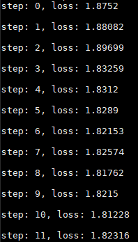
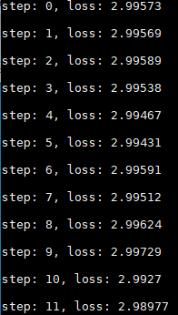
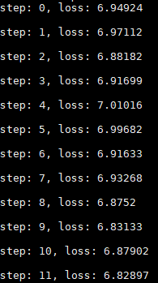

It's the tutorial for your reference to the on-device training in bolt.   

# Compilation

If you are building whole bolt project, you can use *--train* option to open on-device training module. Here are two examples:

- Target to android aarch64

```
./install.sh --target=android-aarch64 -t 36 --train
```

- Target to x86 servers

```
./install.sh --target=linux-x86_64 -t 36 --train
```

# Usage

Bolt provides three easy-to-use applications, namely [Lenet](./demos/lenet_demo/lenet_demo.cpp), [Mobilenet_v1](./demos/mobilenet_v1_demo/mobilenet_v1_demo.cpp) and [Resnet18](./resnet18_demo/resnet18_demo.cpp).  

---

### Lenet

- [ ] Download lenet.onnx from https://github.com/ONNC/onnc-tutorial/blob/master/models/lenet/lenet.onnx ;
- [ ] Use [onnx-simplifier](https://github.com/daquexian/onnx-simplifier) to simplify <u>lenet.onnx</u> and get the simplified model <u>lenet_sim.onnx</u> ;
- [ ] [Run X2bolt to convert lenet_sim.onnx to **lenet_sim_train.bolt**](../docs/USER_HANDBOOK.md#model-conversion);

```
// Model Conversion
# ./X2bolt -d /path_to_onnx_lenet -m lenet_sim -t
```

- [ ] Execute train_lenet with dataset [mnist](http://yann.lecun.com/exdb/mnist/) and  **lenet_sim_train.bolt**.

```
// Training with bolt
# ./train_lenet
```



### Mobilenet_v1

- [ ] Download mobilenet_v1.caffemodel and mobilenet_v1.prototxt from https://github.com/shicai/MobileNet-Caffe ;
- [ ] Download https://www.kaggle.com/whitemoon/miniimagenet and use python scratch to process the data; 
- [ ] [Run X2bolt to convert mobilenet_v1.caffemodel and mobilenet_v1.prototxt to **mobilenet_v1_train.bolt**](../docs/USER_HANDBOOK.md#model-conversion);

```
// Model Conversion
# ./X2bolt -d /path_to_caffe_mobilenet -m mobilenet_v1 -t
```

- [ ] Execute train_mobilenet_v1 with dataset mini-imagenet and mobilenet_v1_train.bolt

```
// Training with bolt 
# ./train_mobilenet_v1
```



### Resnet18

- [ ] Download resnet18.onnx from https://github.com/onnx/models/tree/main/vision/classification/resnet/model ;
- [ ] Use [onnx-simplifier](https://github.com/daquexian/onnx-simplifier) to simplify <u>resnet18.onnx</u> and get the simplified model <u>resnet18_sim.onnx</u> ;
- [ ] [Run X2bolt to convert resnet18_sim.onnx to **resnet18_sim_train.bolt**](../docs/USER_HANDBOOK.md#model-conversion);

```
// Model Conversion
# ./X2bolt -d /path_to_onnx_resnet18 -m resnet18_sim -t 
```

- [ ] Execute train_resnet18 with resnet18_sim_train.bolt

```
# ./train_resnet18
```



# API

Here we provide two types API:

- **High-level**(recommended)

  In order to quickly construct and train your model, it's convenient to use [high-level api](./demos/common/training.h) to build your training graph from bolt model. You can refer to the [demos](./demos).

- **Low-level**

  If you would like to highly customize your training model, please use the [low-level api](./api/training/api).

# Training Modules

## Layers

| Layer                     | Description |
| ------------------------- | ----------- |
| GeLU activation           | gaussian error linear activation function |
| HSigmoid activation       | hard sigmoid activation function |
| HSwish activation         | hard swish activation function |
| Leaky ReLU activation     | leaky rectified linear unit activation function |
| Log Softmax activation    | logarithmic softmax activation function |
| ReLU activation           | rectified linear unit activation function |
| Sigmoid activation        | sigmoid activation function |
| Softmax activation        | softmax activation function |
| Softplus activation       | softplus activation function |
| Swish activation          | swish activation function |
| Tanh activation           | hyperbolic tangent activation function |
| ArgMax                    | returns indices where values is the maximum value of each row in the given dimension |
| ArgMin                    | returns indices where values is the minimum value of each row in the given dimension |
| Average pooling           | 2D averaging over an input tensor |
| Batch expander            | broadcast input tensor with shape [1, D, H, W] to [BatchSize, D, H, W] |
| Batchnorm 2D              | batch normalization over 4D input tensor ([batch, channel, 2D inputs]) |
| Clamp                     | clamp all elements in input into the range [ min, max ] and return a resulting tensor |
| Concatenation             | layer combine sub-tensors to one |
| Convolution 1D            | 1D convolution over input tensor |
| Convolution 2D            | 2D convolution over input tensor |
| Convolution deptwise      | 2D convolution over input tensor, each channel processed separately |
| CumSum                    | cumulative sum of elements |
| Data                      | entry point for data to a model |
| Dropout                   | dropout layer |
| Dynamic depthwise conv 2D | channel-wise dynamic convolution 2D layer |
| Elementwise compare       | element-wise comparison layer |
| Elementwise div           | element-wise division layer |
| Elementwise max           | element-wise maximum layer |
| Elementwise min           | element-wise minimum layer |
| Elementwise mul           | element-wise multiplication |
| Elementwise sub           | element-wise subtraction |
| Elementwise sum           | element-wise addition layer |
| Embedding                 | word embeddings using lookup table |
| Exp                       | element-wise exponential layer |
| Fake quant                | floating-point quantization layer simulating quantization and dequantization |
| Fixed bias                | layer that adds a scalar to tensor |
| Global average pool       | global average pooling layer |
| Index fill                | fills the elements of the tensor with specified value |
| L2 norm                   | divides all elements in input tensor by L2 norm calculated across chosen dimension |
| L2 squared norm           | L2 squared normalizing layer |
| Label smoothing           | label smoothing layer |
| LayerNorm                 | layer normalization 1D |
| LayerNorm2D               | layer normalization 2D |
| Linear                    | affine transformation layer |
| Log                       | natural logarithm layer |
| Masked fill               | fills input tensor elements corresponding to ones in mask with fill value |
| Matmul                    | scalar multiplication of last two dimensions |
| Maxpool                   | 2D max-pooling over input |
| Non-zero mask             | element-wise non-zero mask |
| Padding                   | adds paddings to input tensors |
| Positional encoding       | encodes symbol position in sequence into embedding vector |
| Random choice             | randomly outputs one of it's input tensors |
| Random select             | returns a tensor of elements selected from either x or y, depending on dropout rate |
| Random tensor             | creates tensor filled with values from normal distribution |
| Reduce batch mean         | computes mean of elements across dimensions of a tensor |
| Reduce max                | returns maximum values of each row of the input tensor in the given dimension |
| Reduce mean               | computes mean of elements across dimensions of a tensor |
| Reduce min                | returns minimum values of each row of the input tensor in the given dimension |
| Reduce non-zero           | computes the number of non-zero elements along dimensions of a tensor |
| Reduce std                | computes the standard deviation of elements across dimensions of a tensor |
| Reduce sum                | computes the sum of elements across dimensions of a tensor |
| Repeate interleave        | creates a new tensor repeating elements along chosen dimension |
| Reshape                   | reshaping of a tensor |
| Reverse                   | reverse the order of a tensor |
| Roll                      | layer that rolls tensor along the given dimension |
| Round                     | returns a tensor with each of the elements of input rounded to the closest integer |
| RSqrt                     | returns a new tensor with the reciprocal of the square-root of each of the elements of the input |
| Scale                     | layer of multiplication by a scalar |
| Select                    | returns a tensor of elements selected from either x or y, depending on condition |
| Slicer                    | extracting sub-tensors |
| Splitter                  | duplication of a tensor |
| Sqrt                      | returns a new tensor with the square-root of each of the elements of input |
| Square                    | returns a new tensor with the square of each of the elements of input |
| Tensor                    | inserts a constant tensor into a topology |
| Tile                      | creates a new tensor by replicating input multiples times |
| Transpose                 | swap dimensions according to parameters |
| Transposed convolution 1D | 1D transposed convolution operator over an input image |
| Transposed convolution 2D | 2D transposed convolution operator over an input image |

## Optimizers

| Optimizer     | Description |
| ------------- | ----------- |
| Adadelta      | Adagrad optimization with learning rates decay |
| Adagrad       | stochastic gradient descent optimization with adaptive learning rates |
| Adam          | stochastic gradient descent optimization with adaptive per-parameter learning rates based on gradients moments |
| AdaMax        | Adam optimization with infinity norm |
| AdamW         | computes individual adaptive learning rates for different parameters from estimates of first and second moments of the gradients taking into account weight decay |
| ASGD          | averaged stochastic gradient descent |
| LAMB          | layer-wise adaptive moments optimizer for batch training |
| Momentum      | stochastic gradient descent optimization with momentum |
| NAG           | Nesterov accelerated gradient method |
| Ranger        | combines RAdam + lookahead + gradient centralization into a single optimizer |
| RMSProp       | root mean squared propagation optimization |
| RProp         | resilient backpropagation optimization |
| SGD           | simple stochastic gradient descent optimization |

## Loss Functions

| Loss                          | Description |
| ----------------------------- | ----------- |
| Binary cross entropy          | measures the binary cross entropy between the target and the input probabilities |
| Cross entropy                 | cross-entropy loss function |
| Kullback-Leibler divergance   | Kullback-Leibler divergence loss |
| L1                            | creates a criterion that measures the mean absolute error between each element in the input x and target y |
| MSE                           | creates a criterion that measures the mean squared error between each element in the input x and target y |
| Negative log-likelihood       | measures a negative log-likelihood loss |
| Sigmoid cross-entropy         | measures the probability error in discrete classification tasks in which each class is independent and not mutually exclusive |
| Softmax cross-entropy         | measures the probability error in discrete classification tasks in which the classes are mutually exclusive |